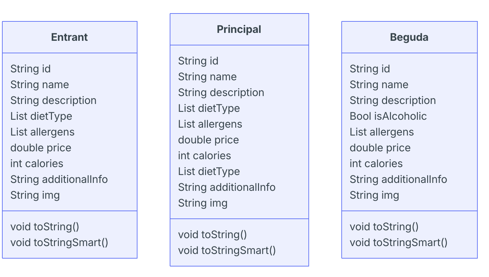

# Oriented programming in Dart

Object-oriented programming is very important in Dart, and especially in Flutter, since the entire design of interfaces using *widgets* is based on these concepts.

## Classes and Constructors

The basic syntax for creating a class in Dart is quite similar to other languages, such as Java:

```dart
class ClassName {
    Type1 property1;
    Type2 property2;
    ...

    // Constructor (optional)
    ClassName(Type1 arg1, Type2 arg2, ...) {
        property1 = arg1; // We can use this.property1, but it is not recommended
        property2 = arg2; // Likewise with this.property2
        ...
    }
}
```

Let's look at some details. On the one hand, the class constructor is optional. If it is not declared, Dart uses a default constructor with no arguments.

If we add a constructor to the class, it is a method with the same name as the class and no return type, as in Java.

Notice that in the example we defined the properties as *nullable*. If we do not do this, the compiler will give us the error *Non-nullable instance field 'property_name' must be initialized*, indicating that the property needs to be initialised. We can provide these initial values in the property definitions themselves:

```dart
class ClassName {
    Type1 property1 = initial_value_1;
    Type2 property2 = initial_value_2;
    ...
}
```

### Object Instantiation

To create an object of the class above, we could do:

```dart
ClassName object = ClassName(param1, param2);
```

Although we can use the `new` keyword (`new ClassName(param1, param2)`), it is optional, and when working with Flutter, it is recommended not to use it.

On the other hand, if we try to print the object (`print(object);`), it will tell us that it is an instance of `ClassName`. If we want it to display its contents, we should override the `toString` method as follows:

```dart
@override
String toString() {
  return 'Property1: $property1, Property2: $property2';
}
```

It is worth noting that in Dart, the `@override` annotation is also optional, so we could omit it.

On the other hand, in expressions such as the one above, we need to be especially careful if we choose to use `this`. Although it is not recommended, if we use it, we need to use braces to delimit the scope of `$`, as follows:

```dart
return 'Property1: ${this.property1}, Property2: ${this.property2}';
```

If we simply used `$this.property1` or `$this.property2`, we would be attempting to print the class itself (`$this`), which would cause this method to be invoked recursively, resulting in an infinite loop.

A more complete example of what we have explained could be the following:

```dart
class Person {
    String? name;
    String? surname;

    Person(String arg1, String arg2) {
        name = arg1;
        surname = arg2;
    }

    @override
    String toString() {
      return 'Name: $name, Surname: $surname';
    }
}

void main() {
  Person object = Person("Luke", "Skywalker");
  print(object.toString());
}
```

You can check how it works in the following Gist: https://dartpad.dev/?id=ef81399b2c2675ff9ead65d16f3b171e.

[iframe](https://dartpad.dev/embed-dart.html?id=ef81399b2c2675ff9ead65d16f3b171e)

### Constructor Simplification

The constructor can be simplified as follows:

```dart
ClassName(this.property1, this.property2);
```

This also means that the properties are initialised in the same declaration, so there is no need to declare them as *nullable*.

For the `Person` class example, we would have:

```dart
Person(this.name, this.surname);
```

### Constructors with Named Arguments

It is also quite common to pass constructor initialisation parameters by name rather than positionally. We achieve this using curly braces `{}`:

```dart
ClassName({
    required this.property1,
    required this.property2
});
```

The use of the reserved keyword `required` indicates that the argument must be provided, thus avoiding null values. If we did not use `required`, we would either need to indicate that the property is *nullable* or provide it with a default value, either in its definition or in the constructor parameters:

```dart
// In the property definition
class ClassName {
    ...
    Type? property1; // Nullable property
    Type property2 = value; // With a default value
    Type property3;
    ...
    ClassName({
        this.property1,
        this.property2,
        this.property3 = value // Default value in the constructor
    });
}
```

**The `late` Keyword**

When we define a property as non-nullable and are not going to initialise it in the declaration itself, we can use the reserved keyword `late`:

```dart
late Type property;
```

This indicates that the property will be initialised later. If the compiler detects that it is being used before initialisation, it will produce an error. This allows us to declare variables and initialise them later (for example, in the constructor).

In any case, when we create an object this way, we do so with:

```dart
ClassName object = ClassName(
    property1: value1,
    property2: value2,
    ...
);
```

The order in which we specify the arguments does not matter, since what matters now is the name.

You can see a more detailed example of the `Person` class in the following Gist: https://dartpad.dev/id=438a3989dd9643df3c5eaa97e259ae29.

[iframe](https://dartpad.dev/embed-dart.html?id=438a3989dd9643df3c5eaa97e259ae29)

### Multiple Named Constructors

Dart does not support constructor overloading. To make it possible to construct objects using different methods, named constructors are used. They also provide greater clarity in declarations. To define a named constructor, we use a dot to separate the class name from the constructor name:

```dart
ClassName.named_constructor1(argument_list_1) {...}
ClassName.named_constructor2(argument_list_2) {...}
...
```

We will see a specific example of using these constructors in the following section.

### Factory Constructors

Factory constructors can be used when we want to control object creation in a more complex way than with traditional constructors. With a factory constructor, we can return existing instances of a class (they do not necessarily have to create a new instance) or even instances of a subclass.

To create a factory constructor, we simply place the `factory` keyword before the constructor name:

```dart
factory className() {...}
```

Factory constructors are useful when we want to control object instantiation, for example, by implementing the Singleton pattern or maintaining a cache of previously created objects.

### Initialisation from a Dictionary

One of the most interesting and common aspects of Dart is creating objects from a dictionary or JSON. For example:

```dart
final jsonObject = {
    property1: value1,
    property2: value2
};
```

To create the object, we can create a named constructor that is initialised from JSON, as follows:

```dart
class ClassName {
    ...
    ClassName.fromJSON(Map<Type1, Type2> jsonObject) {
        property1 = jsonObject['property1'] ?? "default_value1";
        property2 = jsonObject['property2'] ?? "default_value2";
        ...
    }
    ...
}
```

Let's look at the details:

* The `ClassName.fromJSON` constructor receives a dictionary (`Map`) as an argument, which will be used to initialise the instance's properties.
* When declaring the map as an argument, we define the types of the key and value (`<Type1, Type2>`). If they are not specified, Dart infers the types directly.
* Inside the constructor, we assign values to the properties by retrieving them from the JSON. If the property is not found in the JSON, we can use the `??` operator to assign default values.

We have also mentioned that a named constructor provides clarity to definitions. In this case, we have used a name that explicitly indicates that JSON is used to create the object (`.fromJSON`), but the name could be anything.

To create an object this way, we can now use:

```dart
ClassName myObject = ClassName.fromJSON(jsonObject);
```

**Example**

Continuing with the example of defining people, we could use a named constructor as follows:

```dart
class Person {
  ...
  Person.fromJSON(Map<String, dynamic> jsonObject) {
    name = jsonObject['name'];
    surname = jsonObject['surname'];
    birthYear = jsonObject['birthYear'];
    species = jsonObject['species'] ?? "Human";
  }
}

void main() {
  ...
  Map<String, dynamic> myJSON = {
    "name": "Han",
    "surname": "Solo"
  };

  Person p3 = Person.fromJSON(myJSON);
  print(p3.toString());
}
```

You can find the complete example in the following Gist: https://dartpad.dev/?id=21a4a94acecb821196438a3e410cc141.

[iframe](https://dartpad.dev/embed-dart.html?id=21a4a94acecb821196438a3e410cc141)

#### Initialisation from a Dictionary and Factory Constructors

The example from the previous section is a good candidate for implementation using a *factory constructor*.

First, we implement the normal constructor and then a **factory constructor**, which uses the normal constructor to create the instance from the dictionary:

```dart
class Person {
  String? name;
  String? surname;
  int? birthYear;
  String? species;

  // Normal constructor
  Person({
    this.name,
    this.surname,
    this.birthYear,
    this.species
  });

  // Factory constructor
  factory Person.fromJSON(Map<String, dynamic> json) {
    return Person(
      name: json['name'],
      surname: json['surname'],
      birthYear: json['birthYear'],
      species: json['species']
    );
  }
}
```

**Important**

Notice that the factory method (`Person.fromJSON`) uses the `Person` constructor.

This distinction is very important, since it is actually the `Person` constructor that *constructs* the object. The factory constructor does *not create the instance* directly; instead, the normal constructor does. The factory constructor therefore uses the normal constructor but, like any constructor, returns an instance of the class.

### Initializer Lists

Another way in which we may encounter constructors in Dart is through initializer lists, consisting of a list of initialisations separated by commas that are executed before the constructor body. For example, the `Person.fromJSON` constructor from the previous section could have been expressed using an initializer list as follows:

```dart
Person.fromJSON(Map<String, dynamic> jsonObject)
    : name = jsonObject['name'],
      surname = jsonObject['surname'],
      birthYear = jsonObject['birthYear'],
      species = jsonObject['species'] ?? "Human";
```

As we can see, the only thing we have done is remove the braces that defined the block and use a colon to indicate the comma-separated list of initialisers.

### Accessor Methods

Dart does not have reserved keywords such as `public` or `private`. By default, every property we declare is public. If we want it to be private, we indicate this in its name by making it start with an underscore `_`.

```dart
class ClassName {
    Type _privateProperty;
}
```

However, it is important to note that this level of privacy applies at the library level, or what would be a package in Kotlin or Java, and represents the application.

Therefore, from any class in our application, we will have access to the properties of its other classes, whether public or private.

So, does it make sense to use accessor methods? Although they are less common, accessor methods can be used to obtain derived properties or to set values based on these derived properties.

To create *getters* and *setters*, we do so as follows:

```dart
returnType get derivedPropertyName {
    return property_calculation;
}

set derivedPropertyName(Type parameter) {
    // Update internal properties
}
```

For example, if we want to add a derived field representing age to the `Person` class, we could define the `get` and `set` methods as follows:

```dart
class Person {
  String? name;
  int? birthYear;
  ...

  int get age {
    // Get the current date by instantiating a DateTime object
    DateTime currentTime = DateTime.now();

    // The year is found in the year property of the currentTime object
    return currentTime.year - (birthYear ?? 0);
  }

  set age(int age) {
    // Set the birth year based on the age
    this.birthYear = DateTime.now().year - age;
  }
}
```

In these methods, we have used the [*DateTime*](https://api.dart.dev/stable/2.18.5/dart-core/DateTime-class.html) class, which represents data related to time. With `DateTime.now()` we obtain the current instant, from which we can obtain the year using the `year` property.

In this case, what we do is *define* a `set` and a `get` method that, using the current year and the year of birth, manage a *derived property* called age. Therefore, with an object of type *Person*, we can use `age` as if it were a property of the class itself:

```dart
p.age = 40;
print(p.age);
```

You can see the complete example in the following Gist: https://dartpad.dev/?id=778bd9b1b8ddd253a6d1e7899b729a06.

[iframe](https://dartpad.dev/embed-dart.html?id=778bd9b1b8ddd253a6d1e7899b729a06)

## Inheritance

For a class to be inherited, it needs to have an empty constructor with no arguments, which will be the default constructor used by subclasses. **The other constructors are not inherited.**

```dart
class SuperClass {
  String property1;

  // Default constructor with an initializer list
  SuperClass() : property1 = "Default value in the superclass";

  // Named constructor (not inherited)
  SuperClass.fromString(String s) : this.property1 = s;
}
```

To define a subclass, we use the `extends` keyword:

```dart
class SubClass extends SuperClass {
  // Constructors are not inherited
}
```

We can then create instances of the subclass with:

```dart
// Instance of the subclass
SubClass sc1 = SubClass();
print("Property 1 of the subclass: ${sc1.property1}");
```

What we cannot do, for example, is use the named `fromString` constructor in the subclass:

```dart
SubClass sc2 = SubClass.fromString("Test"); // Error, the fromString constructor is not inherited!
```

However, we can define the constructor in the subclass and invoke the superclass constructor:

```dart
class SubClass2 extends SuperClass {
  // Named constructor that invokes the
  // named constructor of the parent class.
  SubClass2.fromString(String s) : super.fromString(s);
}
```

Now we can invoke:

```dart
SubClass2 sc2 = SubClass2.fromString("Test");
```

## Abstract Classes

As we know, abstract classes cannot be instantiated and are used to define subclasses, which must necessarily implement the methods specified in the abstract class. To indicate that a class is abstract, we use the `abstract` keyword. For example:

```dart
abstract class Shape {
  int posx;
  int posy;

  void calculateArea() {
    print('Default calculation');
  }
}

class Rectangle extends Shape {
  int width;
  int height;

  @override // Optional
  void calculateArea() {
    print(this.width * this.height);
  }
}
```

## Interfaces and Mixins

Dart introduces the concept of an *implicit interface*, meaning that any class can be used as an interface. To declare that a class implements the methods of another class, we use the reserved keyword `implements`.

```dart
class ClassThatImplementsInterface implements ClassActingAsInterface {
  // Implementation of the methods of the class acting as an interface
}
```

Dart, like most languages, does not support multiple inheritance. In addition, unlike most of these languages, interfaces are not usually used as an approach to this type of inheritance.

The mechanism Dart introduces for creating classes that would be a combination of other classes is ***mixins***, a concept closer to multiple inheritance than to interfaces.

A *mixin* could be defined as a class derived from another class but combined with other classes. To define a *mixin*, we use the `with` keyword.

For example, if we have classes A, B, and C defined, with methods `fA()`, `fB()`, and `fC()` respectively:

```dart
class A {
  void fA() {
    print("In A");
  }
}

class B {
  void fB() {
    print("In B");
  }
}

class C {
  void fC() {
    print("In C");
  }
}
```

We can define the `MixedClass` mixin as a class derived from class A, but *mixed with* classes B and C:

```dart
class MixedClass extends A with B, C {}
```

This indicates that `MixedClass` derives from class A, but also has the properties and methods of classes B and C available, so we can do the following:

```dart
MixedClass m = MixedClass();
m.fA();
m.fB();
m.fC();
```

**Warning!**

When we create *mixins* with classes that have the same methods or properties, we need to bear in mind that the mixin implementation is superimposed onto a superclass to generate a new class. Therefore, the order in which we define the mixins is very important.

For example, if we have the following classes:

```dart
class A {
  void f() {
    print("Method f in A");
  }
}

class B {
  void f() {
    print("Method f in B");
  }
}

class C {
  void f() {
    print("Method f in C");
  }
}
```

We can see that all three define the `f()` method. However, it is not the same to define the mixin as:

```dart
class MixedClass extends A with B, C {}
```

as:

```dart
class MixedClass extends A with C, B {}
```

In the first case, the `f()` method from class *C* will be included in the new class, whereas in the second case it will be the method from class *B*.

You can find more information about mixins in the article [*What Are Mixins?*](https://medium.com/comunidad-flutter/dart-qu%C3%A9-son-los-mixins-5f2ab880a4ce).

# Main activity

> **ACTIVITY:** We are going to create an app to manage a menu. For now, you are going to create the entities of the domain layer (the classes of the database). The API we are going to use later in the HTTP part is in Valencian, so I recommend to use the same name for the entities.
>
>The domain layer represents the *core* layer of the application and contains the business logic and domain entities. This layer is represented by the `lib/domain` folder.
>
>When the business logic is complex, a sublayer of use cases (`usecases`) can be introduced, which encapsulates this business logic. In our case, we are not going to use this layer.
>
>What we are going to use are the ***Domain Entities***, located in the `lib/domain/entities` folder. These entities are the classes that represent the main concepts of our business domain.
>
>In our case, the entities we will work with are:

* `Starters` -> `entrants`
* `Main Courses` -> `principals`
* `Drinks` -> `begudes`



> * Create an abstract class `producte` with the common attributes and methods

> As we can see:
> 
> * All classes share the following properties, which we add to the `Product` class:
> 
>   * `String id`: A product identifier.
>   * `String name`: The name of the product.
>   * `String description`: A description of the product.
>   * `String tipus`: The product subtype.
>   * `List<String> allergens`: A list of allergens in the product.
>   * `double price`: The price of the product.
>   * `int calories`: The calories of the product.
>   * `String additionalInfo`: Additional information about the product.
>   * `String img`: The URL of the image on the server.
> * The derived classes `Starter` and `MainCourse` add a new property: `dietType`, which is a list of the diets for which the dish is suitable (vegan, gluten-free, etc.).
> * The derived class `Drink` includes a boolean property `isAlcoholic`, to indicate whether the drink contains alcohol or not.
> * The methods defined by the `Product` class, which the derived classes will have to override, are:
> 
>   * `toString()`: returns a String representation of the object.
>   * `toStringSmart()`: returns a **multiline string** (defined using triple quotes `'''`) with a more user-friendly representation of the object.
>   * A new `getClass()` method has been added, which returns an enum containing the name of the class (`starter`, `main`, or `drink`).
> 
> **Constructors**
> 
> Although they are not shown in the UML diagram to avoid adding *noise*, all classes have their corresponding **constructors**, which receive the arguments required for initialization as a **list of named arguments**.
> 
> In addition, the derived classes (`Starter`, `MainCourse`, and `Drink`) have a [**named factory constructor** ](https://joamuran.net/flutter2026/u2/2.6.POO/#inicialitzacio-amb-diccionari-i-constructors-de-factoria)[**`fromJSON()`**](https://joamuran.net/flutter2026/u2/2.6.POO/#inicialitzacio-amb-diccionari-i-constructors-de-factoria), which returns an instance of the class from a JSON object.
> 
> ## Coloring the Output
> 
> If we want to color the output, we can use the following ANSI escape codes for colors:
> 
> ```text
> Black:   \x1B[30m
> Red:     \x1B[31m
> Green:   \x1B[32m
> Yellow:  \x1B[33m
> Blue:    \x1B[34m
> Magenta: \x1B[35m
> Cyan:    \x1B[36m
> White:   \x1B[37m
> Reset:   \x1B[0m
> ```
> 
> For example, to print text in red, we would use:
> 
> ```dart
> print("\x1B[31mText in red\x1B[0m");
> ```
> The project has to have this structure:
```text
.
├── bin
│   └── healthys_cli.dart
├── lib
│   ├── data
│   │   ├── repositories
│   │   │   └── carta_repository.dart
│   │   └── services
│   │       └── healthys_api.dart
│   └── domain
│       └── entities
│           ├── entrant.dart
│           └── producte.dart
├── pubspec.yaml
└── README.md
```text
